# CS-MIO
Compressive-sensing assisted mixed-integer optimization (CS-MIO) is a solver for data driven discovery of dynamical system from highly noisy data.

## Source Code
This directory contains the Python source code for discovering the exact governing equations from highly noisy data.

- **DataGenerator**: This folder contains the data generator for the studied dynamcal system examples.
- **Optimizer**: The CS_MIO optimizer is included in this folder for training to obtain the governing equations of dynamical systems.
- **test_xx**: These are the testing code to obtain the goverining equations for a specific dynamical system by directly running it.
- **Util**: This directory contains the necessary tools for smoothing noise by total variation
- **Models**: This directry contains the tool for library construction.
- **docs**: The resulting figures for the learned models.

The time series data of state variables $\mathbf{x}$ are collected in a time instants $t_1,t_2,\dots,t_N$ and organized into two matrices $\mathbf{X}$ and $\dot{\mathbf{X}}$. The augmented library matrix $\boldsymbol{\Theta}(\mathbf{X})$ is established according to the constructed term library. We then apply the CS-MIO algorithm to uncover each equation by solving the resuling discrete optimization problem, i.e., to identify a term is included in the equation (1) or not (0).

**How to use CS-MIO**

The main entry of the CS-MIO optimizer is to set the parameters of the method as below.

    def __init__(
                self,
                dimension=3,              # dimension of the dynamical system
                order=2,                  # polynomial order of the constructed terms in $\boldsymbol{\Theta}(\mathbf{X})$
                num_candidate_terms=100,  # number of the candidate terms reamined after the compressive sensing algorith
                lasso_alpha=0.000001,     # regularization value for the compressive sensing
                intercept=True,           # whether or not to model the intercept in the model
                term_ks=[],               # number of nonzero terms specified in the equations as a vector
                betas_ub=1000,            # the upper bound for solving the MIO problem 
                betas_lb=-1000,           # the lower bound for solving the MIO problem
                time_limit=600,           # time limit for solving the MIO problem
                mip_gap=0.0,              # the gap of the solution to the best lower bound. 
                                          # Either time_limit or mip_gap satisfication will trigger stopping of the MIO algorithm.
                mip_detail=False,         # whether to show the details of the MIO solving procedure.
        ):

## Examples
### Lorenz3 system
We consider to collect data from the below 3-dimensional chaotic Lorenz system governed by the following equations:

$\dot{x} = \alpha (y-x),$

$\dot{y} = x (\rho - z) - y,$

$\dot{z} = x y - \beta z.$

In this example, to obtain the governing equations of Lorenz 3 dynamical system, we run the below code by first generating the data, then applying the CS-MIO algorithm, and finally plotting the leanred model in figure. See details in test_lorenz3.py, in which the main code is displayed as below.
  

    # Generate training data
    x, y, snr = lorenz3.lorenz3generator(seed=40, noise_type=1, data_noise=300, end_time=60)
    print('SNR: %.4f' % snr)

    # Discover equations. We define the system dimension to be 3. We use the fifth-order polynomial terms to construct the library. 
    # We can manualy set the number of nonzero terms in the governing equations using a vector [2,3,2] for Lorenz 3 system. Or we can obtain this by the tuning             # procedure by cross validation in the paper. 
    model = CSMIO(optimizer=CSMIOOptimizer(dimension=3, order=5, term_ks=[2, 3, 2]))
    model.fit(x, y)

    # show the trajectory of identified equations
    lorenz3.plot_trajectory(model)

Below figure shows the trajectory of CS-MIO learned dynamical system under the additive Gaussina noise $N(0,300^2 I)$ to $\mathbf{\dot{x}}$ and Gaussian noise $N(0, 2^2 I)$ to $\mathbf{x}$, respectively.

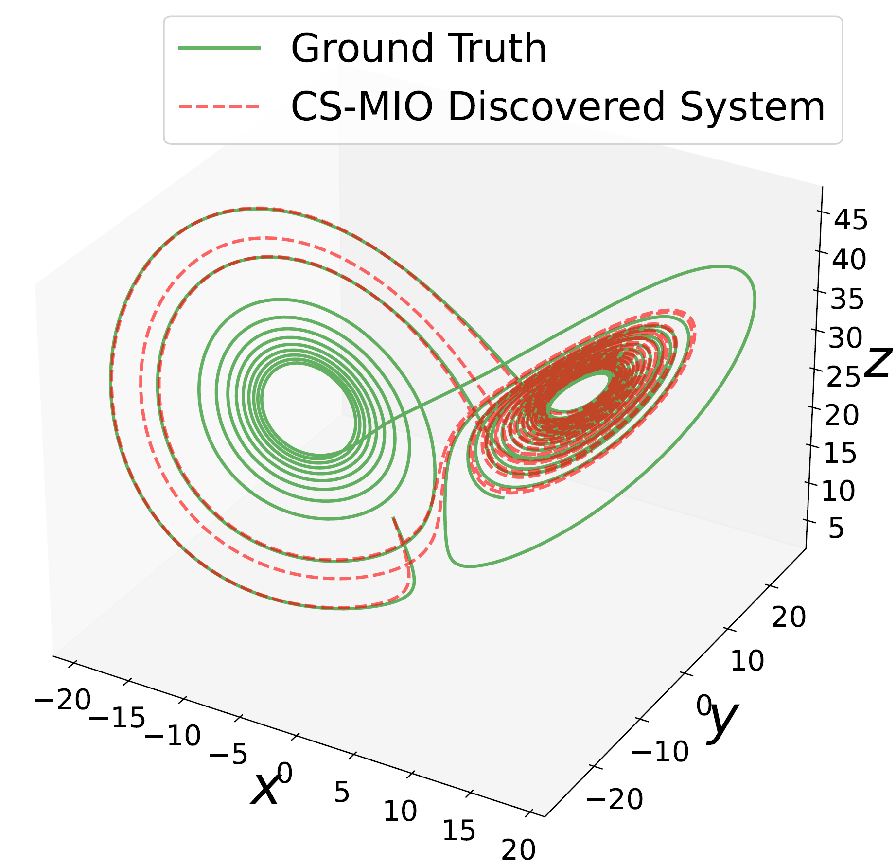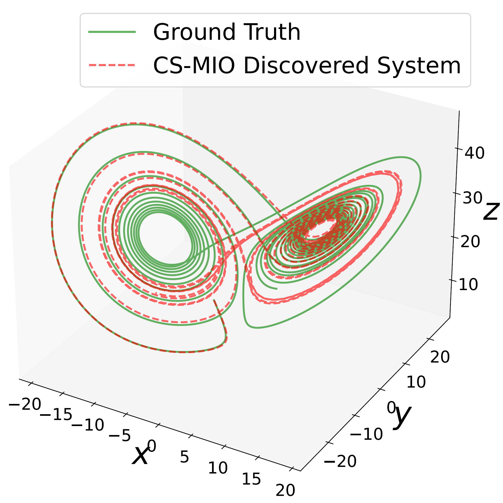

### Lorenz 96
The chaotic Lorenz 96 dynamical system is governed by

$$\dot{x}_j = (x_{j+1}-x_{j-2})x_{j-1} - x_j + F,$$ 

where j=1,2,...,N is the dimension of the dynamical system. We set N=96 and use second order polynomials, resuling a high-dimensional problem with 4753 terms in the constructed library. See details in test_lorenz96.

Below figure shows the Hovermoller plot for difference between the identified system and ground truth of Lorenz 96 system in $t \in[0,10]$. The vertical axis is the index $j$ of the state variable. The values of the colors refer to the difference between the ground truth states $x_j(t)$ and the evolved states $\hat{x}_j(t)$ using the identified equations by CS-MIO. The more white-colored areas indicate the trajectory of the identified system agrees better with the ground truth.

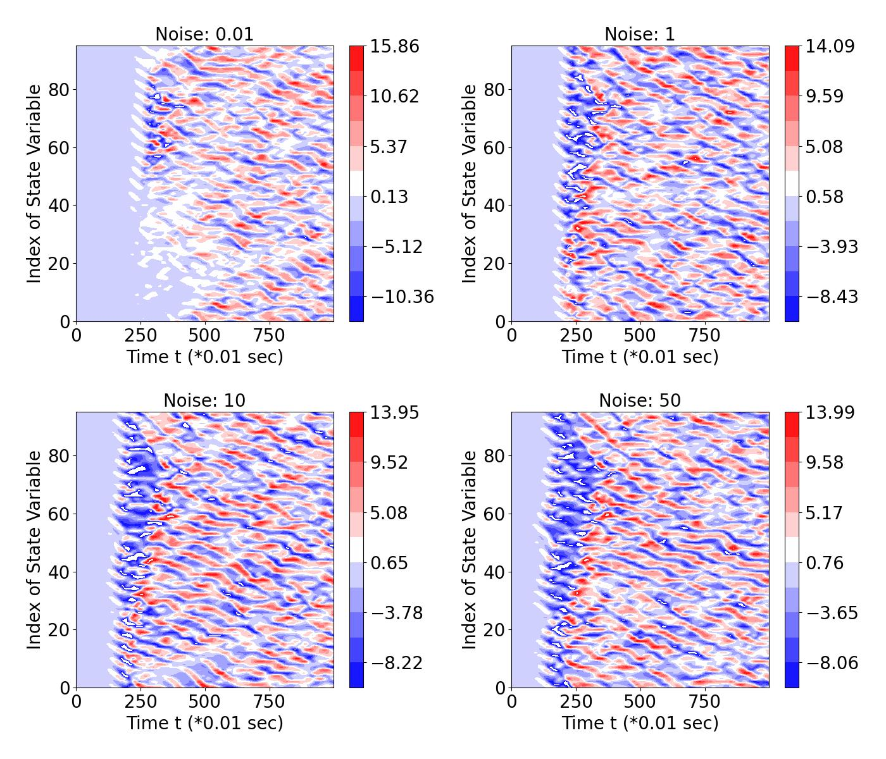

### Bifurcations and parameterized system
-**Hopf normal form** 

The Hopf normal form is governed by the below governing equations,

$\dot{x}  = \mu x - \omega y + Ax(x^2+y^2),$

$\dot{y}  = \omega x + \mu y + Ay(x^2+y^2).$

14 values of $\mu$ are used to simulate the system for collection 14 dataset, which afterwards are stacked into a single dataset. Then $\mu$ is considered to be an additional variable and the equations are uncovered. See details in test_hopf_nf.py.

The trajectories for the ground truth, the CS-MIO learned dynamical system with additive Gaussian noise $N(0,3^2 I)$ to $\dot{\mathbf{x}}$ and $N(0, 0.015^2 I)$ to $\mathbf{x}$ are as below.

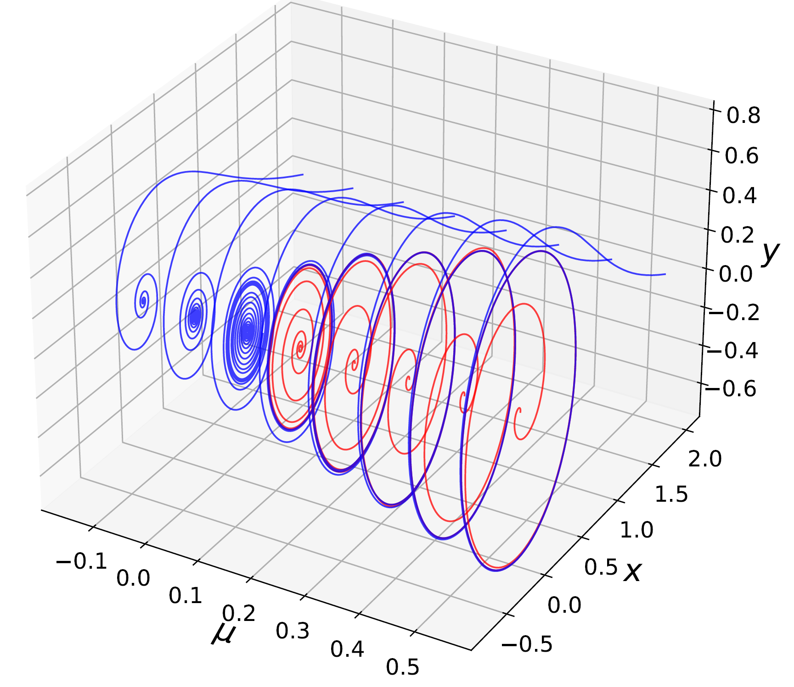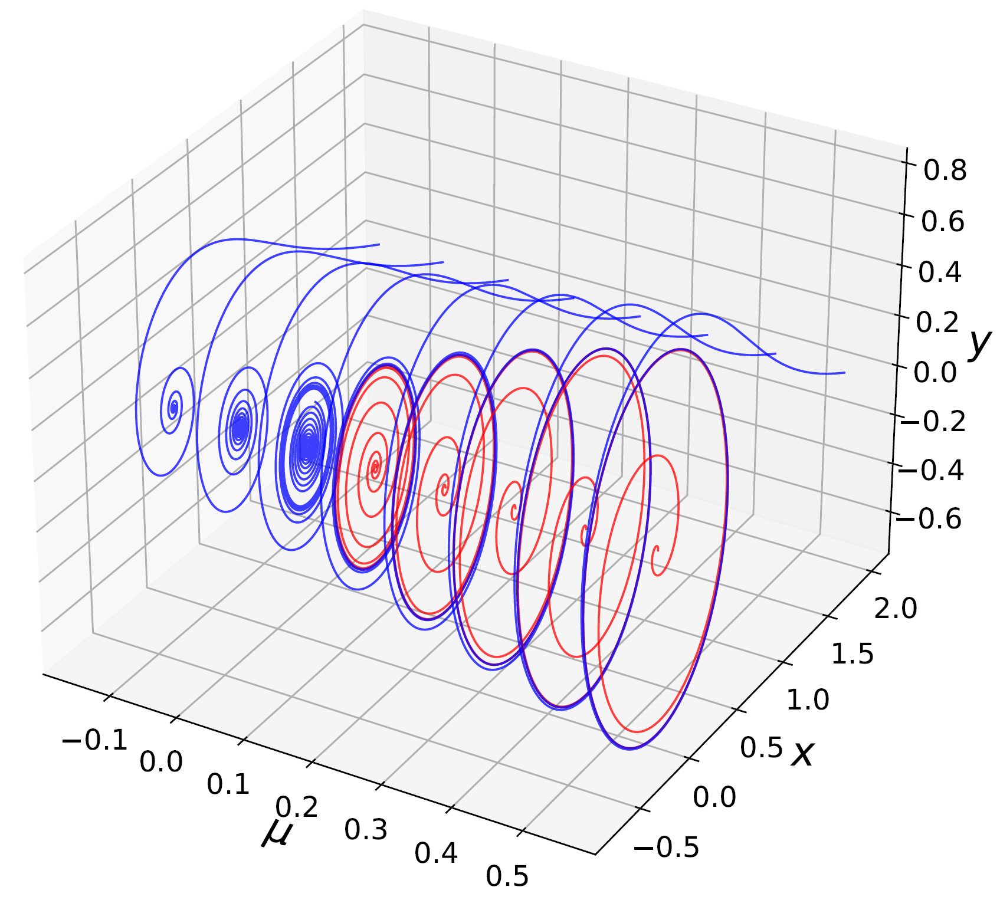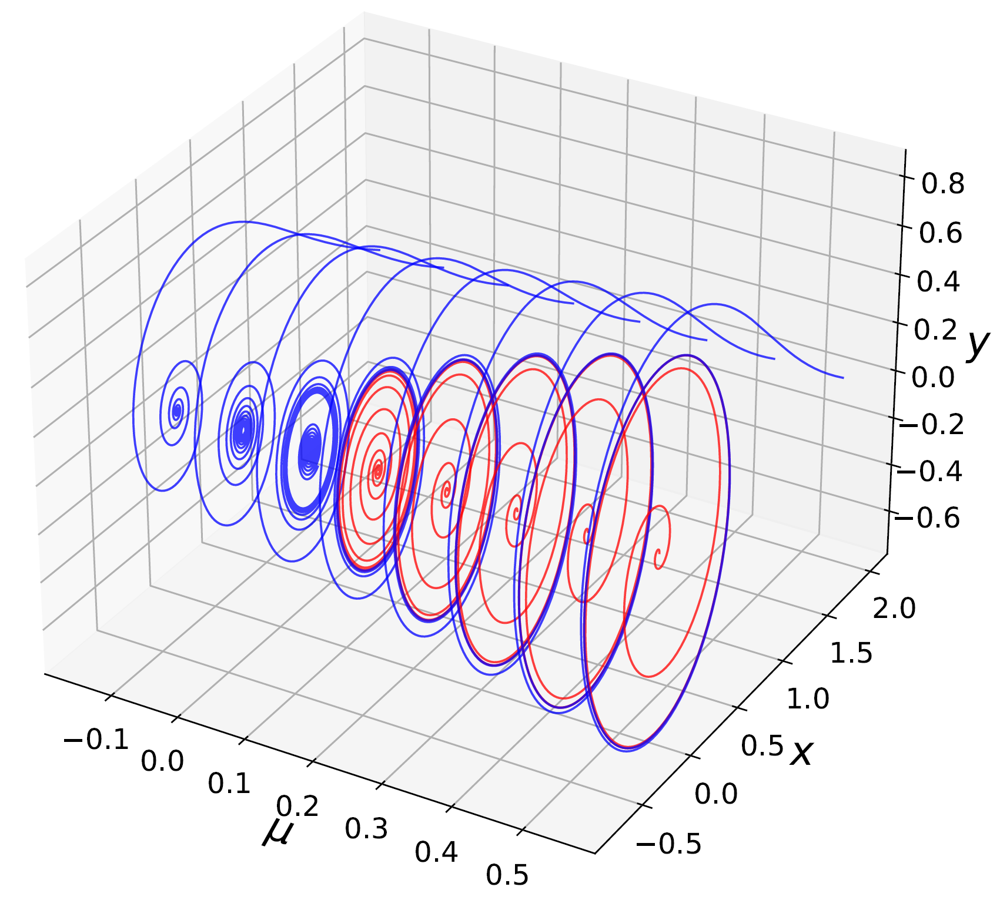

-**Logistic map**

The Logistic map is governed by the below equations

$x_{n+1} = rx_{n}(1-x_n) + \eta_n.$

Similar to Hopf normal form, we treat $r$ as an additional variable and use 10 values of $r$ to generate the data.

The trajectories of the ground truth and the CS-MIO learned system under Gaussian noise $N(0,0.6^2)$ to $x_n$ are as below.

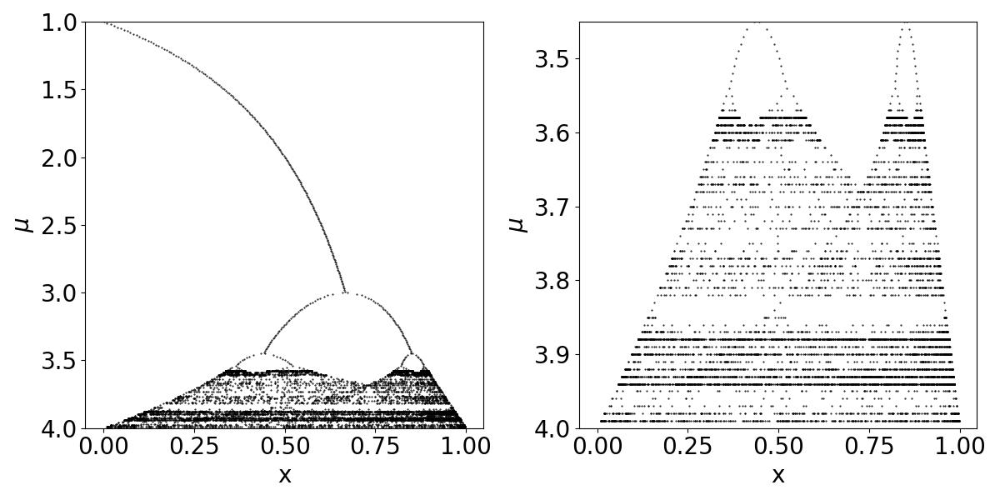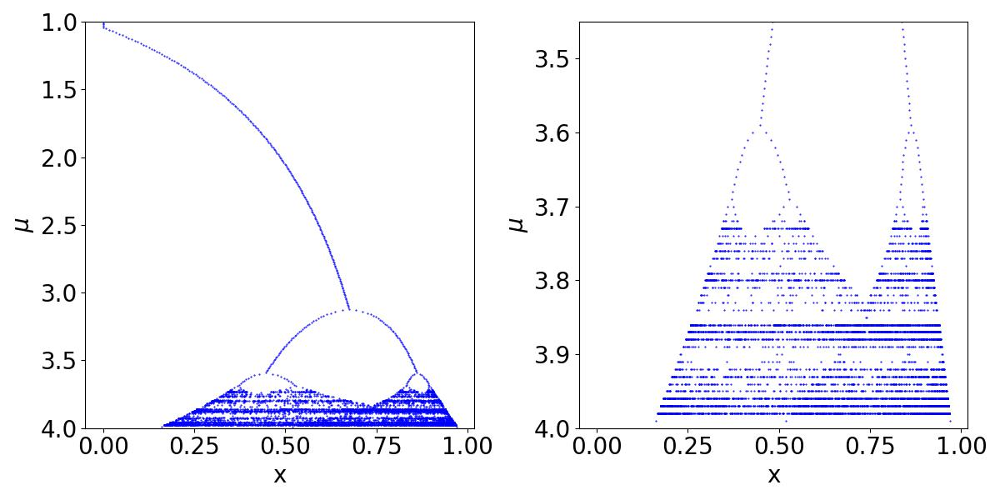

### Vortex shedding behind a cylinder

The last example system is the fluid dynamics for vortex shedding behind a cylinder which are high-dimensional partial differential equations. The high-dimensional PDEs of cylinder dynamics can evolve on a a low-dimensional attractor governed by ordinary differential equations after dimension reduction using proper orthogonal decomposition. The mean-field model using three POD modes as coordinate system is given as follows.

$\dot{x}  = \mu x - \omega y + Axz,$

$\dot{y}  = \omega x + \mu y + Ayz,$

$\dot{z}  = -\lambda (z-x^2 -y^2).$

The trajectories of the ground truth, CS-MIO learned systems with second order polynomials and third order polynomials are shown as below, respectively. See details in test_cylinder.

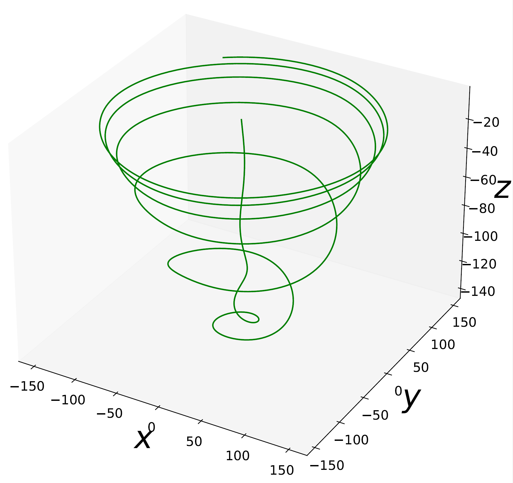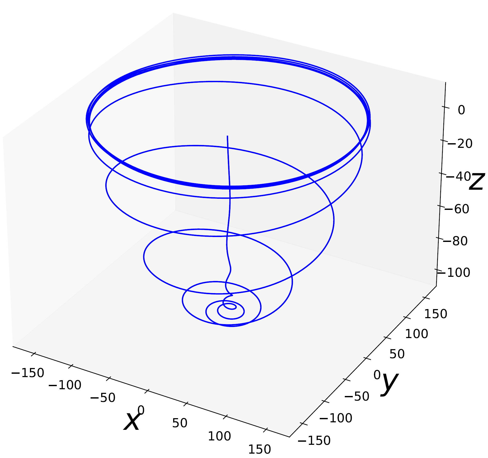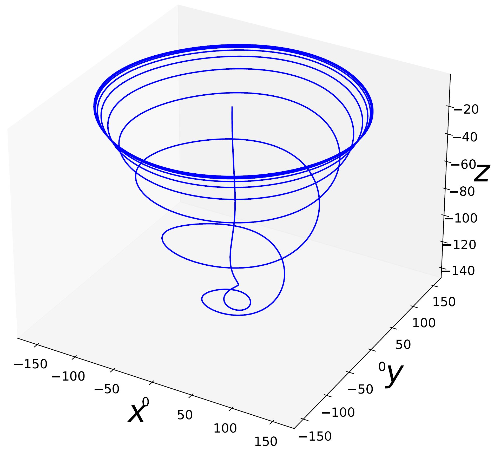
